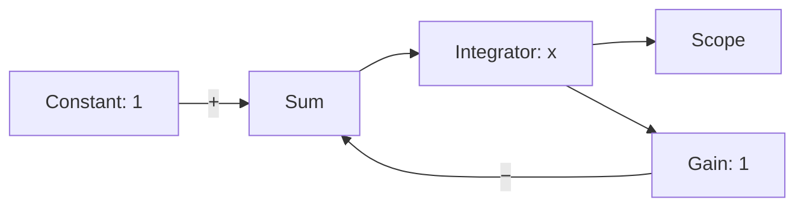

# OpenMat simulation kernel v0

This opt-in workspace implements the numerical foundation for a future block
diagram editor. It runs JSON models and a constrained R2022b SLX subset with a
Rust reference interpreter or actual LLVM ORC machine code. It is independent of the existing web client, server,
bytecode VM and desktop package. There is no graphical editor in this milestone.

The contract is [RFC 0010](../docs/rfcs/0010-simulation-kernel-v0.md). Fixtures and
tests are authored for OpenMat using elementary mathematical models; no MATLAB
or Simulink source, test data, messages or proprietary model files are included.
The SLX extension is described by [RFC 0011](../docs/rfcs/0011-slx-import-v0.md)
and the [SLX import guide](docs/slx-import.md). Loading an SLX document and
supporting its simulation semantics are separate checks; this is not full
Simulink compatibility.

## Run the examples

Run these commands from the repository root with Rust 1.90.0. LLVM is unnecessary
for the reference backend and for emitting textual LLVM IR.

```powershell
cargo run --manifest-path simulation/Cargo.toml --locked -p openmat-sim-cli -- check simulation/examples/first-order.omsim.json
cargo run --manifest-path simulation/Cargo.toml --locked -p openmat-sim-cli -- run simulation/examples/first-order.omsim.json
```

The second command prints a JSON trajectory. Each frame contains simulation time,
a discrete `sampleHit` flag and flattened Scope values. `result.scopes` maps each
Scope block ID to its zero-based offset and component count in that array; this
serialized buffer layout does not change m-language one-based indexing.

| Example | System | Expected result |
| --- | --- | --- |
| [first-order](examples/first-order.omsim.json) | Continuous feedback, `x' = 1 - x`, `x(0) = 0` | `x(t) = 1 - exp(-t)`; about 0.63212054 at t = 1 with the supplied step |
| [delay-counter](examples/delay-counter.omsim.json) | UnitDelay feedback, `y[k+1] = 1 + y[k]` | 0, 1, 2, 3 at t = 0, 0.1, 0.2, 0.3; constant between hits |
| [sampled-feedback](examples/sampled-feedback.omsim.json) | `x' = 1 - q`; q is the preceding sample of x | At the five hits, x = [0, .1, .2, .29, .37], q = [0, 0, .1, .2, .29] |

The first model can be read as:



To save results or inspect a generated kernel:

```powershell
New-Item -ItemType Directory -Force simulation/.openmat | Out-Null
cargo run --manifest-path simulation/Cargo.toml --locked -p openmat-sim-cli -- run simulation/examples/first-order.omsim.json --output simulation/.openmat/result.json
cargo run --manifest-path simulation/Cargo.toml --locked -p openmat-sim-cli -- emit-llvm simulation/examples/first-order.omsim.json --output simulation/.openmat/first-order.ll
```

Output files are created only if the path does not already exist. Use a new name
for subsequent runs. Missing parent directories are errors. On failure the CLI
exits with status 1 and writes a JSON diagnostic to stderr, including block and
port identity where available. LLVM failures never silently select the reference
backend.

## Run actual LLVM machine code on Windows x64

The optional native adapter loads a trusted LLVM 22 shared library specified by
the host. A model cannot select libraries or contain executable source. The
reproducible Windows preparation script needs PowerShell 7, `tar.exe` and network
access on its first run:

```powershell
$env:OPENMAT_SIM_LLVM_LIBRARY = & ./simulation/tools/Prepare-Llvm.ps1
cargo run --manifest-path simulation/Cargo.toml --locked -p openmat-sim-cli -- run simulation/examples/first-order.omsim.json --backend llvm
```

Success includes `execution.backend: "llvm-orc"`, `llvmVersion` and `targetTriple`
in the output. This compiles the same numerical program used by the reference
interpreter through LLVM ORC LLJIT and calls its machine code through
[C ABI v1](include/openmat_sim_kernel.h). It is not general m-language JIT.
The current kernel emits strict f64 operations without fast-math flags. No
performance speedup is asserted by this milestone.

The preparation script downloads only upstream binary packages, checks every
SHA-256 from [llvm-windows.lock.json](tools/llvm-windows.lock.json), and extracts
the runtime and its upstream licenses under `simulation/.openmat/`. It does not
install globally, modify PATH or run package install scripts. The native runtime
is a development dependency and is not included in the desktop installer.

LLVM is pinned to 22.1.8; its dependencies are pinned individually in the lock
manifest. The manifest uses the official
[MSYS2 UCRT64 binary repository](https://repo.msys2.org/mingw/ucrt64/). Redistribution
of a future runtime bundle must preserve the applicable upstream notices; this
workspace commits only source manifests and no third-party source or binaries.

Alternative local locations and offline preparation are explicit:

```powershell
$runtime = Join-Path $env:LOCALAPPDATA 'OpenMat/simulation-llvm'
$archives = Join-Path $runtime 'archives'
$env:OPENMAT_SIM_LLVM_LIBRARY = & ./simulation/tools/Prepare-Llvm.ps1 -Destination $runtime -ArchiveDirectory $archives
# Once all pinned archives are cached:
$env:OPENMAT_SIM_LLVM_LIBRARY = & ./simulation/tools/Prepare-Llvm.ps1 -Destination $runtime -ArchiveDirectory $archives -Offline
```

`--llvm-library PATH` can override the environment variable. The adapter rejects
other LLVM major versions and non-x86-64 hosts. Windows dependency lookup is
restricted to the selected DLL's directory and System32. Linux x86-64 may supply
its own LLVM 22 shared library; native Linux execution is not part of this
milestone's verified support. A kernel remains on its creating thread; separate
instances may be created and run on independent threads.

## Model and execution rules

Models use UTF-8 JSON, suffix `.omsim.json`, and `schemaVersion: 1`. Blocks have
stable ASCII IDs, a `kind` record, and optional editor `position`. Connections
reference a block ID and port name at each end. Reordering or moving blocks does
not change the compiled numerical program. Unknown fields are rejected.

| Block `kind.type` | Parameters | Inputs / output |
| --- | --- | --- |
| `constant` | `value: [double, ...]` | Output `out` |
| `sum` | `signs: [1, -1, ...]` | `in0`, `in1`, ...; output `out` |
| `gain` | `gain: [double, ...]` | `in`; output `out` |
| `integrator` | `initial: [double, ...]` | Derivative `in`; continuous state `out` |
| `unitDelay` | `initial: [double, ...]` | Sampled `in`; held state `out` |
| `scope` | None | Observed `in`; no output |

Signals are finite real f64 scalars or fixed-width column vectors. A scalar is a
one-element vector. Sum requires equal input widths. Gain applies either one
coefficient to every element or a matching vector of coefficients; it does not
perform matrix multiplication. All required inputs need exactly one connection;
outputs may fan out. Non-finite evaluated state or observable output fails the
run with a diagnostic.

Integrator and UnitDelay outputs break instantaneous dependencies. A pure
direct-feedthrough loop is rejected with a block/port diagnostic. The simulator
does not insert a delay or attempt an algebraic solve.

`settings` contains `startTime`, `stopTime`, `maxStep` and, for UnitDelay models,
one shared `sampleTime`. RK4 clips each step to sample hits and the final time.
Numerical trial evaluations never advance delays or publish frames. UnitDelay
has `y[0] = initial` and `y[k] = u[k-1]`; all delays publish their pending outputs
simultaneously before capturing the next inputs. Scope frames at a sample hit
observe the updated outputs. Continuous integration across the preceding
interval uses the held values for that interval.

Time follows the model, not browser frames or wall time. Samples use integer
ticks anchored at `startTime`; tolerances and size bounds are stated in the RFC.
A failed or cancelled runner is terminal and retains its last accepted snapshot.
The collector defaults to 100,000 frames and 8,000,000 observed scalar values;
`--max-samples COUNT` changes the frame cap. Streaming callers can consume
`Runner::advance()` and use an `AtomicBool` with `advance_with_cancel()` instead
of retaining a complete trajectory. This is not a hard real-time engine or a
multi-user resource scheduler.

## Code boundaries and next integration

| Crate | Responsibility |
| --- | --- |
| `openmat-opc` | Bounded ZIP/OPC parts, content types and relationships; independent of SLX |
| `openmat-sim-slx` | Structural SLX inspection, retained source parts, compatibility diagnostics and lowering to the existing numerical model |
| `openmat-sim` | Model validation, instantaneous dependency ordering, immutable numerical IR, reference execution, RK4 and sample scheduling |
| `openmat-sim-llvm` | Textual LLVM IR, dynamic LLVM C API adapter, owned ORC code and C kernel ABI |
| `openmat-sim-cli` | Model loading, backend selection and bounded JSON result output |

The numerical IR is scalarized, typed f64 SSA, with inputs `[time, x, q]` and
outputs `[dx/dt, next_q, scopes]`. Its verified operations are input, constant,
addition, multiplication and negation. Both backends share it; graph logic and
time scheduling stay outside LLVM. Program identity includes constant bit
patterns, including signed zero. A runner refuses a kernel for a different
program.

The next integration can add a React block editor and a native server job that
loads the same versioned models and streams accepted frames. The native runtime
continues to compute independently of browser rendering. Existing server
protocols and routes are deliberately unchanged in this opt-in workspace.
SUNDIALS can later replace the continuous solver behind this state/evaluation
contract; algebraic loops, DAE initialization, events and multiple sample rates
need additional semantics and tests before being enabled. Typed m-language
functions can later lower into an expanded numerical IR; the language's current
bytecode execution remains intact.

## Verify

```powershell
cargo fmt --manifest-path simulation/Cargo.toml --all --check
cargo clippy --manifest-path simulation/Cargo.toml --locked --workspace --all-targets --all-features -- -D warnings -D clippy::pedantic
cargo test --manifest-path simulation/Cargo.toml --locked --workspace
$env:OPENMAT_SIM_LLVM_LIBRARY = & ./simulation/tools/Prepare-Llvm.ps1
cargo test --manifest-path simulation/Cargo.toml --locked -p openmat-sim-llvm --test native -- --ignored --nocapture
cargo test --manifest-path simulation/Cargo.toml --locked -p openmat-sim-slx --test import -- --ignored --nocapture
```

The ordinary workspace tests mark the four kernel native tests and one SLX native
test as ignored because LLVM is optional. The last two commands explicitly run
them, require a working LLVM runtime and fail if it is unavailable. Native
acceptance covers continuous/discrete/mixed/vector trajectory parity, strict
arithmetic including signed zero, C ABI guards, empty programs and concurrent
independent create/run/drop cycles. Reference tests also compare with analytic
solutions and RK4 convergence rather than relying on backend parity alone.

Two additional, explicitly ignored SLX differential tests require a separately
licensed local MATLAB/Simulink R2022b installation. The [SLX guide](docs/slx-import.md)
explains how to generate the project-authored models and run those tests against
both backends. Generated SLX packages and observations are not checked in.

[The simulation workflow](../.github/workflows/simulation.yml) runs ordinary
checks on Windows and Linux and explicitly requires native ORC execution on
Windows. Local Windows acceptance does not substitute for a remote CI run or
verification on a fresh end-user machine. Before committing, also run the
repository's staged public-source and whitespace checks.
